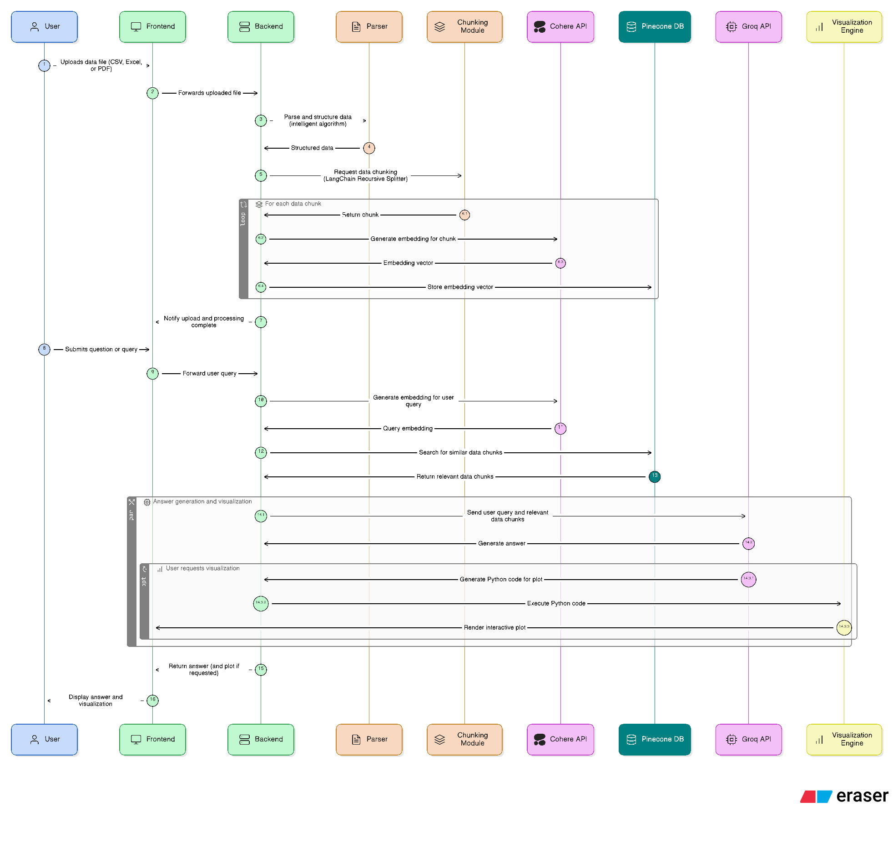

DataInsight Pro
Project Overview
DataInsight Pro is a robust, AI-powered analytics application designed for intuitive exploration and insight generation from personal or business sales data. It supports seamless upload and parsing of multiple file types, delivers context-aware responses, and generates custom visualizations through an advanced Retrieval-Augmented Generation (RAG) pipeline.​

Features
Multi-format data upload: Accepts CSV, Excel, and PDF files with smart parsing and auto-detection.

Automated chunking: Segments data intelligently using the LangChain Recursive Text Splitter for optimized processing.

AI embeddings: Converts data and user queries into vectorized formats using Cohere API for rapid semantic search.

Vector database retrieval: Stores embeddings in Pinecone for fast similarity-based contextual fetches.

LLM-powered answers: Leverages Groq API to generate contextual responses and executable plot code.

Custom visualizations: Builds interactive charts with Matplotlib/Seaborn and displays them to users.

Scalable modular design: Easily extensible for future data types, analytics, and integration.

Architecture Diagram
Below is the end-to-end user workflow and system architecture for DataInsight Pro, :

​

Flow Description:

Users upload data files.

Data is parsed, chunked, embedded, and indexed for semantic retrieval.

User queries trigger embedding search and LLM-driven answer generation.

Requests for plots result in Python code generation and dynamic chart rendering.​

Quick Start
Clone this repository

text
git clone https://github.com/SomaanRauniyar/DataInsightPro.git
Install dependencies

text
pip install -r requirements.txt
Run the application

Launch in your preferred environment (web app, Jupyter Notebook, or backend).

Upload your dataset and start querying or visualizing.

Folder Structure
text
data/
├── raw/
├── processed/
src/
├── chunking.py
├── embeddings.py
├── file_parser.py
├── vector_manager.py
├── visualization.py
notebooks/
├── analysis.ipynb
Technologies Used
Python 3.x

FastAPI, Streamlit (optional for UI)

Pandas, NumPy, Matplotlib, Seaborn

LangChain, Cohere API, Pinecone DB, Groq API

License
Open source under the MIT License.

